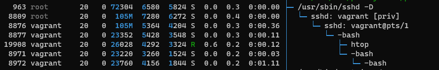
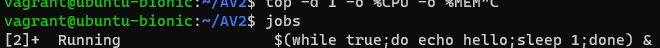
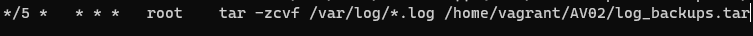

## Capítulo 6

 - Atividade 6.1 
  `ps -r` 
  `top -d 1 -o %CPU -o %MEM` 

  
 
 - Atividade 6.2 
  `htop (F5 para exibição em modo árvore)` 
 
 `jobs` 
 

- Atividade 6.3 
 
- Atividade 6.4 
`#!/bin/bash` 
`printf "O diretorio atual eh: $(pwd) \n"`
`printf "O Shell desse usuario eh: $(grep $(whoami) /etc/passwd | cut -d ":" -f 7)\n"`
